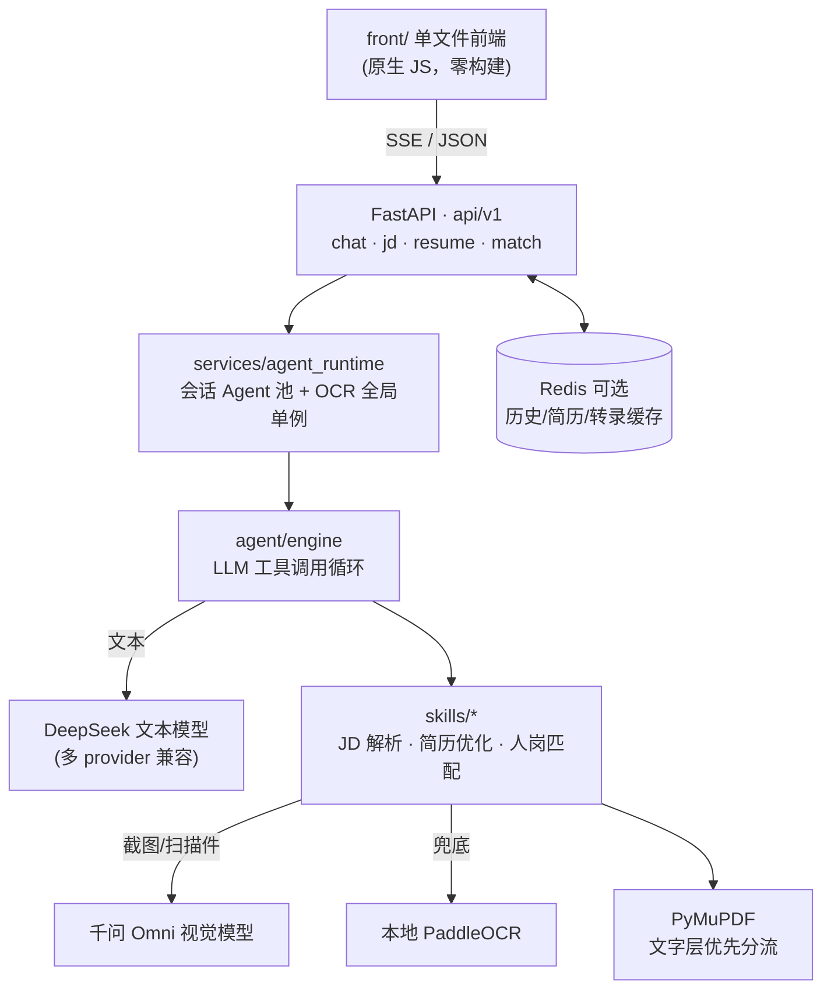

# OfferCatch — AI 求职助手

> An AI job-hunting assistant: parse job descriptions, optimize resumes, and score resume-JD fit — powered by an extensible LLM Agent with vision & OCR.

粘贴或上传 JD 与简历，AI 自动完成 **JD 结构化解析 → 简历定向优化 → 人岗匹配分析**；同时内置一个支持**工具调用（function calling）**的对话 Agent，技能与工作流可插拔扩展。

## ✨ 功能特性

| | 能力 | 说明 |
|---|---|---|
| 💬 | **AI 对话（Agent）** | LLM 工具调用循环；内置 JD 解析 / 简历优化 / 人岗匹配三个求职技能，可注册新 Skill / Workflow（见 [EXTENSION_GUIDE.md](EXTENSION_GUIDE.md)） |
| 📋 | **JD 解析** | 文本 → LLM 结构化抽取；截图 → 视觉模型直读。统一输出 9 字段 JSON（岗位 / 职责 / 要求 / 薪资 / 地点…）；MD5 缓存，同图二次上传零成本 |
| 📝 | **简历优化** | 文本 / 图片 / PDF 三路输入；PDF 先走文字层直读（免费且准），扫描件自动渲染逐页识别；SSE 实时进度推送，AI 按目标岗位定向改写 |
| 📊 | **人岗匹配** | LLM 深度评分 + 关键词引擎兜底降级；输出可视化 HTML 匹配报告 |
| 🔌 | **多模型双通道** | 文本对话 / 抽取走 DeepSeek 等文本模型，图片直读走千问 Omni 视觉模型；未配置视觉 key 时自动回落本地 OCR |
| 🛡 | **优雅降级** | Redis 可选：未启动 / 断连自动降级纯内存模式，功能不中断 |

## 🧠 架构总览



- **Agent 引擎**：`agent/engine.py` 实现 LLM 工具调用循环（流式 + 非流式双通道）；`agent/skill.py` / `workflow.py` 为注册中心，领域能力以 Skill 为单元插入（可参考 [EXTENSION_GUIDE.md](EXTENSION_GUIDE.md) 扩展）
- **输入分流**：PDF 先提文字层 → 无文字层才渲染 OCR → OCR 又分云 VL / 本地引擎两级，失败自动降级，全程 MD5 缓存
- **对话记忆**：Redis 存会话历史（30 分钟 TTL）+ 简历缓存（24h）；无 Redis 时自动切换进程内内存

## 🛠 技术栈

- **后端**：Python 3.11 · FastAPI · SSE 流式 · Pydantic v2
- **LLM**：`openai` SDK 兼容层，支持 deepseek / siliconflow / zhipu / moonshot / qwen / doubao 多提供商
- **视觉 / OCR**：DashScope Qwen-Omni（VL 云转录）+ PaddleOCR（本地兜底）
- **文档处理**：PyMuPDF（文字层提取 / 逐页渲染）· Pillow（预处理）
- **存储**：Redis（可选，对话历史 / 简历 / 转录缓存）
- **前端**：原生 HTML/CSS/JS 单文件（`front/index.html`，由后端伺服，无构建步骤）

## 🚀 快速开始

```bash
# 1. 依赖（纯文本模式可先注释掉 requirements.txt 中的 paddlepaddle/paddleocr）
pip install -r backend/requirements.txt

# 2. 配置
cp .env.example .env
```

**最小配置（仅文本对话 / JD 文本解析）**：

```ini
LLM_PROVIDER=deepseek
DEEPSEEK_API_KEY=sk-xxxx
```

**启用图片直读 / 扫描件识别（文本 + 视觉双通道）**：

```ini
VISION_API_KEY=sk-xxxx                      # DashScope API Key
VISION_BASE_URL=https://dashscope.aliyuncs.com/compatible-mode/v1
VISION_MODEL=qwen3.5-omni-flash             # ⚠️ 必须用小写 API ID
```

**启动**：

```bash
cd backend
uvicorn app.main:app --port 7860
# 浏览器打开 http://localhost:7860
```

可选方式：

- **Docker 一键起（含 Redis）**：根目录 `docker compose up --build`
- **CLI 对话**：`cd backend && python -m app.cli`

完整变量说明见 [.env.example](.env.example)（每项均有注释）。

## 📁 目录结构

```
backend/
└── app/
    ├── main.py            # FastAPI 入口（uvicorn app.main:app，端口 7860）
    ├── cli.py             # CLI 对话模式（python -m app.cli）
    ├── api/v1/            # 接口层：chat / jd / resume / match（JSON + SSE）
    ├── agent/             # Agent 引擎：LLM 工具调用循环 + Skill/Workflow 注册中心
    ├── skills/            # 技能库
    │   ├── common/        #   公共能力：OCR 引擎 · PDF 分流 · 转录缓存
    │   ├── jd_parser/     #   JD 结构化解析（LLM / VL）
    │   ├── resume_optimizer/   # 简历优化（解析 + AI 改写）
    │   └── resume_jd_matcher/  # 人岗匹配（LLM 评分 + 关键词 + HTML 报告）
    ├── workflows/         # 预置工作流（JD 解析流水线等）
    ├── services/          # agent_runtime：会话 Agent 池 + OCR 全局单例
    ├── core/config.py     # 多提供商 LLM / 视觉模型配置
    ├── db/                # Redis 封装（断连自动降级内存）
    └── schemas/           # 请求 DTO
front/
└── index.html             # 单文件前端（对话 + JD + 简历 + 匹配四模块）
```

## 🔌 API 一览

| 端点 | 说明 |
|---|---|
| `POST /api/chat` | SSE 流式对话（Agent 工具调用） |
| `POST /api/clear` / `GET /api/status` | 按会话清空历史 / 查看 Agent 状态 |
| `POST /api/jd/parse-text` | JD 文本 → LLM 结构化（9 字段） |
| `POST /api/jd/parse-image` | JD 截图 → 视觉模型直读（MD5 缓存） |
| `POST /api/match` | 简历文本 + JD → 匹配评分与报告 |
| `POST /api/match/pdf` | PDF 简历 + JD（文本 / 图片 / PDF）→ OCR 后匹配 |
| `POST /api/resume/optimize-text` | 简历文本优化（SSE） |
| `POST /api/resume/optimize-file` | 简历图片 / PDF 优化（SSE，逐页进度） |
| `GET /api/resume/{id}` | 取回 24h 内缓存的简历解析 / 优化结果 |

## 📸 界面截图

<!-- TODO: 截图另存到 screenshots/ 后替换下方两行 -->
<!--  -->
<!--  -->
